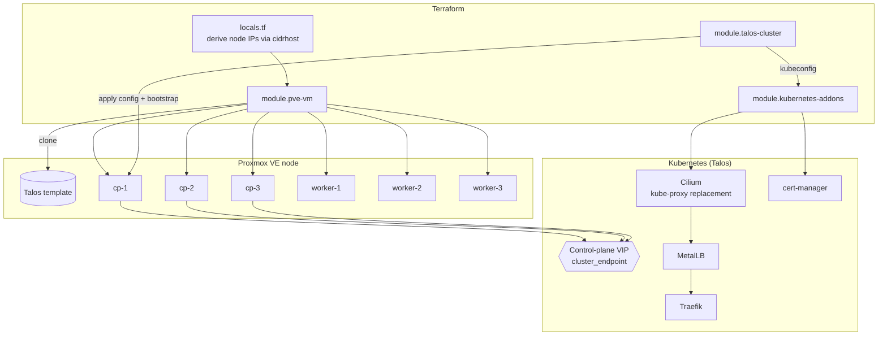

# terraform-pve-talos-kubernetes

Production-quality Infrastructure-as-Code that provisions and manages a
**Talos Linux** Kubernetes cluster on **Proxmox VE**, end-to-end, with a single
`terraform apply`:

1. Clones VMs from an existing Talos template on Proxmox.
2. Generates and applies Talos machine configs (no manual `talosctl`).
3. Bootstraps etcd / Kubernetes automatically.
4. Retrieves the kubeconfig + talosconfig.
5. Installs Cilium, MetalLB, Traefik and cert-manager.

Scaling is a one-line change (`worker_count`), and the whole cluster can be
destroyed and recreated from scratch. Everything is GitOps-friendly and runnable
locally or via GitHub Actions.

---

## Architecture



### Module layout

| Module                | Responsibility                                                       |
| --------------------- | ------------------------------------------------------------------- |
| `pve-vm`              | Clone one VM from the Talos template, set static IP via cloud-init.  |
| `talos-cluster`       | Secrets → machine configs → apply → bootstrap → kubeconfig + VIP.    |
| `kubernetes-addons`   | Helm releases for Cilium/MetalLB/Traefik/cert-manager.              |

Root config is split by technology: `resources-pve-vm.tf`, `resources-talos.tf`,
`resources-kubernetes.tf`, `resources-network.tf`, `resources-storage.tf`, each
with a matching `variables-*.tf`.

---

## Environment assumptions to review

These opinionated defaults likely need adjusting for **your** Proxmox setup
(set the relevant variables in `terraform.tfvars`):

| Assumption          | Default        | Variable                                   |
| ------------------- | -------------- | ------------------------------------------ |
| Storage pool        | `local-lvm`    | `vm_datastore_id`, `cloudinit_datastore_id`|
| Disk bus / dev path | `scsi0` / `/dev/sda` | `disk_interface`, `install_disk`     |
| Network bridge      | `vmbr0`        | `network_bridge`                           |
| Talos template      | `talos-template` (resolved to VMID) | `template_name` / `template_id` |
| Node subnet         | `192.168.10.0/24` | `node_network`, `gateway`, `dns_servers`|
| Control-plane VIP   | n/a (required) | `cluster_endpoint`                         |
| VMID ranges         | cp `8000+`, worker `9000+` | `control_plane_vmid_base`, `worker_vmid_base` |

The IP plan is **derived**: control planes start at host offset `20`
(`x.x.x.20`), workers at `30`, and the VIP is whatever you set as
`cluster_endpoint` — keep it free and outside the MetalLB pool.

---

## Prerequisites

- An existing Proxmox VE node/cluster you can reach over the API.
- Terraform **>= 1.9**.
- A Proxmox **API token** (`root@pam!terraform` or a least-privilege role).
- `kubectl` and (optionally) `talosctl` for day-2 ops.
- A Talos **template VM** on Proxmox (see below).

---

## 1. Prepare the Talos image / template

Use the [Talos Image Factory](https://factory.talos.dev) to get a **nocloud**
image (so Talos reads the Proxmox cloud-init network config). Then build a
template on the Proxmox host:

```bash
# On the Proxmox node:
VER="v1.9.2"
wget -O /tmp/talos.raw.xz \
  "https://factory.talos.dev/image/376567988ad370138ad8b2698212367b8edcb69b5fd68c80be1f2ec7d603b4ba/${VER}/nocloud-amd64.raw.xz"
xz -d /tmp/talos.raw.xz

qm create 9999 --name talos-template --memory 4096 --cores 2 \
  --net0 virtio,bridge=vmbr0 --scsihw virtio-scsi-single --ostype l26
qm importdisk 9999 /tmp/talos.raw local-lvm
qm set 9999 --scsi0 local-lvm:vm-9999-disk-0
qm set 9999 --boot order=scsi0
qm set 9999 --ide2 local-lvm:cloudinit
qm set 9999 --serial0 socket --vga serial0
qm set 9999 --agent enabled=1
qm template 9999
```

Set `template_name = "talos-template"` (the data source resolves the VMID).

> The schematic ID in the URL is the default (no extensions). Add the
> `qemu-guest-agent` extension via the Factory if you want richer agent data.

---

## 2. Proxmox requirements

- API token with permission to clone/create VMs on the target node and storage.
- `local-lvm` (or your chosen) datastore with room for the disks.
- The `vmbr0` bridge (or your chosen) on the node network.
- Enough capacity: defaults are 3×(4 CPU / 8 GB) control planes + 3×(4 CPU /
  16 GB) workers.

---

## 3. GitHub setup (CI/CD)

Add these **secrets** to the repo (Settings → Secrets and variables → Actions):

| Secret              | Example                                  |
| ------------------- | ---------------------------------------- |
| `PVE_API_URL`       | `https://pve01.example.com:8006/`        |
| `PVE_TOKEN_ID`      | `root@pam!terraform`                     |
| `PVE_TOKEN_SECRET`  | `xxxxxxxx-xxxx-xxxx-xxxx-xxxxxxxxxxxx`    |

And a **variable** `DESTROY_CLUSTER` (only set to `true` when you intend to allow
destroys).

Workflows:

- **`terraform-plan.yml`** — on PRs: `fmt` + `validate` + `plan` (artifact).
- **`terraform-apply.yml`** — on push to `main`: `apply -auto-approve`.
- **`terraform-destroy.yml`** — manual `workflow_dispatch`, requires
  `confirm=true` **and** repo var `DESTROY_CLUSTER=true`.

> Apply/destroy need network reachability to Proxmox and the node network — use
> a **self-hosted runner** in your homelab (the workflows are set to
> `runs-on: [self-hosted]`).

---

## 4. Local deployment

```bash
cp terraform.tfvars.example terraform.tfvars
$EDITOR terraform.tfvars

# Keep secrets out of the file:
export TF_VAR_pve_token_id="root@pam!terraform"
export TF_VAR_pve_token_secret="xxxxxxxx-xxxx-xxxx-xxxx-xxxxxxxxxxxx"

# One-shot:
./scripts/bootstrap-cluster.sh

# ...or manually:
terraform init
terraform plan -out tfplan
terraform apply tfplan

export KUBECONFIG="$PWD/kubeconfig"
kubectl get nodes -o wide
```

`kubeconfig` and `talosconfig` are written to the repo root (git-ignored).

---

## 5. Scaling workers

Edit `terraform.tfvars`:

```hcl
worker_count = 10   # scale up
```

```bash
terraform apply
```

Terraform adds workers `worker-4 … worker-10` with derived IPs and joins them
automatically. Set `worker_count = 2` and apply to cleanly destroy the excess
nodes (the `for_each` map shrinks). Control-plane count should stay odd.

---

## 6. Destroying the cluster

```bash
terraform destroy
```

Or via the **terraform-destroy** workflow (manual, confirmation-gated). This
removes all VMs; recreate at any time with `terraform apply` (a fresh set of
Talos secrets is generated).

---

## 7. Troubleshooting

| Symptom                                   | Likely cause / fix                                                                 |
| ----------------------------------------- | ---------------------------------------------------------------------------------- |
| `apply` hangs on `talos_machine_bootstrap`| Nodes not reachable at static IPs → check cloud-init/nocloud image & `node_network`.|
| `connection refused` to node IP           | Template isn't a **nocloud** image, or wrong bridge/VLAN.                            |
| Install loops / wrong disk                | `install_disk` doesn't match `disk_interface` (scsi→`/dev/sda`, virtio→`/dev/vda`). |
| Cilium pods crashloop                     | `k8sServiceHost` (VIP) unreachable, or kube-proxy not disabled (it is, by default). |
| No external IP on ingress                 | MetalLB pool overlaps node IPs or is outside `node_network`.                         |
| VIP not answering                         | Fewer than the quorum of control planes are healthy; check `talosctl health`.       |

Useful commands:

```bash
talosctl --talosconfig ./talosconfig -n <cp-ip> -e <cp-ip> health
talosctl --talosconfig ./talosconfig -n <node-ip> dashboard
kubectl get pods -A
```

---

## 8. Upgrade strategy

- **Kubernetes:** bump `kubernetes_version`, then
  `talosctl upgrade-k8s --to <ver>` (or re-apply; Talos reconciles).
- **Talos:** bump `talos_version` and roll nodes with
  `talosctl upgrade --image factory.talos.dev/.../<ver> -n <node>` one at a time
  (control planes last). Re-build the template for new clones.
- **Add-ons:** bump `cilium_version` / `metallb_version` / `traefik_version`
  / `cert_manager_version` and `terraform apply`.

Always upgrade one node at a time and verify `kubectl get nodes` / `talosctl
health` between steps.

---

## Outputs

| Output             | Description                          |
| ------------------ | ------------------------------------ |
| `control_plane_ips`| Control-plane node IPs               |
| `worker_ips`       | Worker node IPs                      |
| `cluster_endpoint` | API VIP                              |
| `kubeconfig_path`  | Path to the written kubeconfig       |
| `talosconfig_path` | Path to the written talosconfig      |
| `kubeconfig`       | Raw kubeconfig (sensitive)           |
| `talosconfig`      | Raw talosconfig (sensitive)          |

---

## Security

- No passwords, tokens or kubeconfig are hard-coded. Secrets come from
  `TF_VAR_*` env vars / GitHub Secrets and are marked `sensitive`.
- `terraform.tfvars`, state, `kubeconfig` and `talosconfig` are git-ignored.
- Prefer a least-privilege Proxmox API role over `root@pam`.
